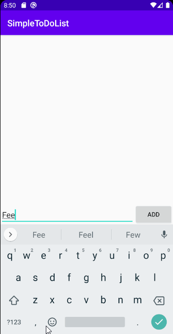
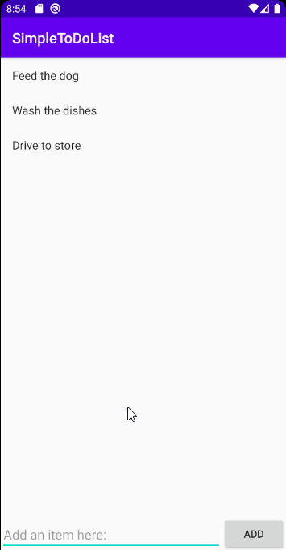
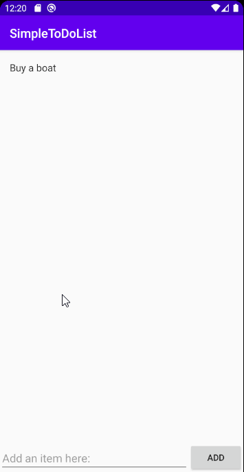
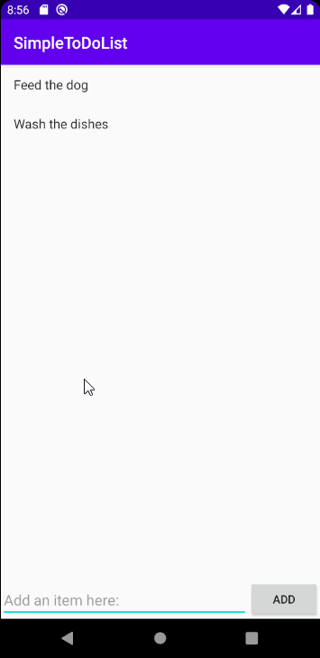

# Project 1 - CodePath To Do List
"CodePath To Do List" is an android app that allows building a todo list and basic todo items management functionality including adding new items, editing and deleting an existing item.
Submitted by: Nicholas Powell

Time spent: 5 hours spent learning and developing application
            1.5 hours spent learning to use GitHub
            1 hour spent creating the video walkthrough
            1 hour spent proofreading
            8.5 hours in total

## User Stories

The following **required** functionality is completed:

* [X] User can **view a list of todo items**
* [X] User can **successfully add and remove items** from the todo list
* [X] User's **list of items persisted** upon modification and and retrieved properly on app restart

The following **stretch** features are implemented:

* [X] User can **tap a todo item in the list and bring up an edit screen for the todo item** and then have any changes to the text reflected in the todo list

The following **additional** features are implemented:

* [ ] List anything else that you can get done to improve the app functionality!

## Video Walkthrough

Add items to your list!

Remove items by pressing down on them!

Write something wrong? Edit your text!

Don't worry about losing your items, the app saves!

## Notes

This was the first mobile application I have ever created. Initially, it felt like I was thrown to the
wolves, but now I feel as if I have a deeper understanding of CRUD (Create, Read, Update and Delete),
something not previously taught to me in my courses. Although, it's going to take a few more lessons
to really cement that knowledge.

    Some problems I encountered:

    - Importing the 'org.apache.commons.io.FileUtils' package because Studio recognized FileUtils
        as within the android package.

    - Trouble deciding where to put the GitHub repositories folder. Not sure if file structure is
        conventional.

    - Minor problems with 'git config user.name' and 'git config user.email' functionality when
        pushing to GitHub on the command line.

## License

    Copyright 2020 Nicholas Powell

    Licensed under the Apache License, Version 2.0 (the "License");
    you may not use this file except in compliance with the License.
    You may obtain a copy of the License at

        http://www.apache.org/licenses/LICENSE-2.0

    Unless required by applicable law or agreed to in writing, software
    distributed under the License is distributed on an "AS IS" BASIS,
    WITHOUT WARRANTIES OR CONDITIONS OF ANY KIND, either express or implied.
    See the License for the specific language governing permissions and
    limitations under the License.
